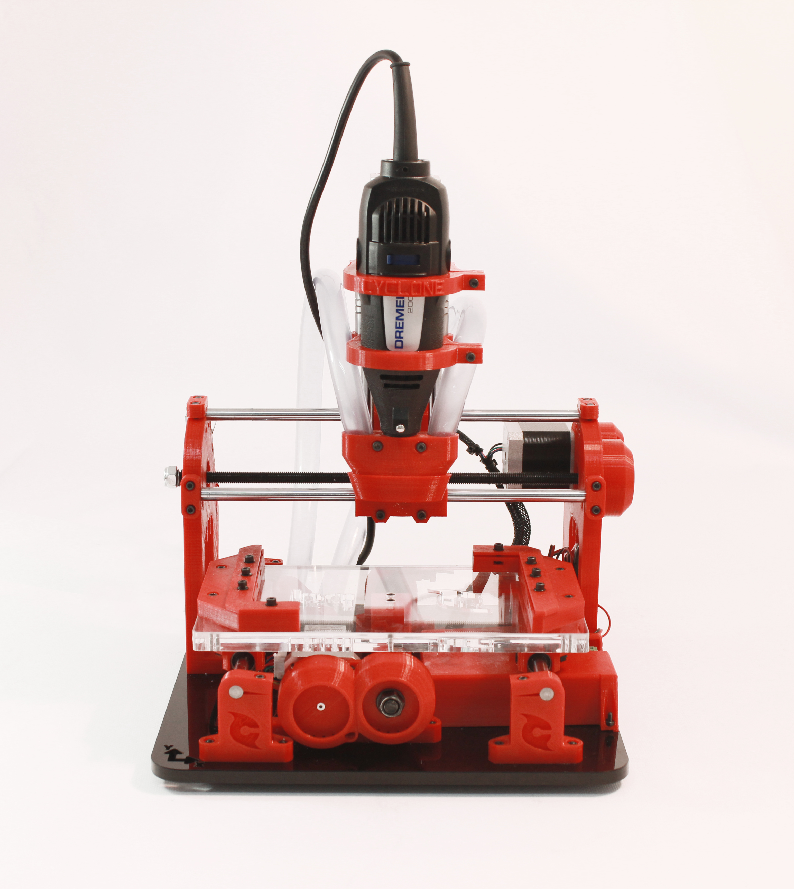

A partir du moment où vous avez assemblé [la totalité de la machine](Montage-axe-Y.md) vous pouvez procéder aux branchements des divers composants électroniques.  

1) Préparez le cable pour l'alimentation
--
  
  

2) Préparez les connecteurs moteurs
--
  
  
  

3) Réalisez le câblage de la machine conformément au schéma suivant
--
  

4) Vous pouvez serrer les connexions au moyen d'un outil de serrage comme celui sur les images suivantes
--
  
  
  

5) Passez les cables dans la machine
--
  

6) Montez le carter de protection de la carte électronique
--
  
  

Vous avez terminé ! Félicitations !! :-)
--
  

