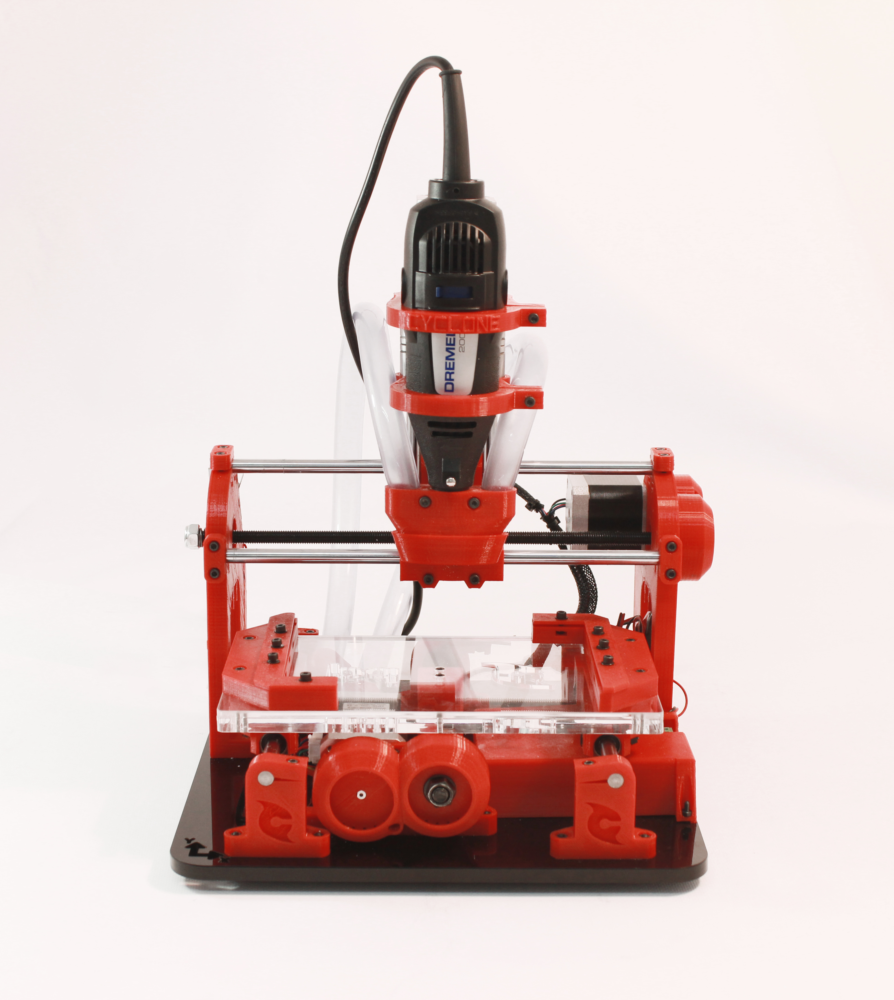

# Documentation Cyclone PCB Factory

Instructions de montage
--
Rassemblez les vitamines à partir de la [**bill of materials**](Bill-of-materials) et **imprimez les pièces en 3D nécessaires** ( utilisez les fichiers de la section [Releases](https://github.com/carlosgs/Cyclone-PCB-Factory/releases) sur GitHub).  
Ensuite, suivez les instructions du manuel dans l'ordre suivant :  

1. [**Montage de l'axe Y**](Montage-axe-Y.md)  
1. [**Montage de l'axe X**](Montage-axe-X.md)  
1. [**Montage de l'axe Z**](Montage-axe-Z.md)  
1. [**Câblage de l'électronique**](Connexion-electronique.md)  

**[Liste des fournisseurs](liste-des-fournisseurs)**

Manuel d'utilisation
--
* [**Hello world! Creuser une boule avec bCNC**](https://github.com/carlosgs/grblForCyclone/wiki/2%29-Hello-World!-Mill-a-bowl-with-bCNC)

Besoin d'aide ? Rejoignez notre Mailing liste / Forum
--
Si ce projet vous intéresse, rejoignez notre mailing liste :  
**English: <https://groups.google.com/forum/#!forum/cyclone-pcb-factory>**  
**Spanish/Español: <https://groups.google.com/forum/#!forum/cyclone-pcb-factory-es>**  

Crédits
--
[Instructions originales](http://diwo.bq.com/como-montar-cyclone-paso-a-paso) par **bq**. Le PDF a été porté en wiki par la communauté Cyclone.  
  
License: **Attribution - Share Alike - Creative Commons (<http://creativecommons.org/licenses/by-sa/4.0/>)**  

Contributeurs
--
* Carlos Garcia Saura
* Roberto Barrilero
* Frédéric Coubard
* *Ajouter votre nom ici en cas de contribution au wiki*

Clause de non responsabilité  
--
Ce matériel/logiciel est fourni "en l'état", et vous utilisez ce matériel/logiciel à vos risques et périles. En aucune circonstance un quelconque auteur ne pourra être tenu responsable du moindre dommage consécutif, incidentel, spécial, indirect ou direct résultant de l'usage, du mauvais usage ou bien encore de l'impossibilité d'utiliser ce matériel/logiciel, même si les auteurs ont été avertis de la possibilité d'occurence de tels dommages.  
