Bienvenue dans la seconde partie du processus d'assemblage. Il vous faut avoir terminé toutes les étapes décrites dans [la partie assemblage de l'axe Y](Montage-axe-Y.md).  

1) Montez les tiges lisses dans le chariot X
--
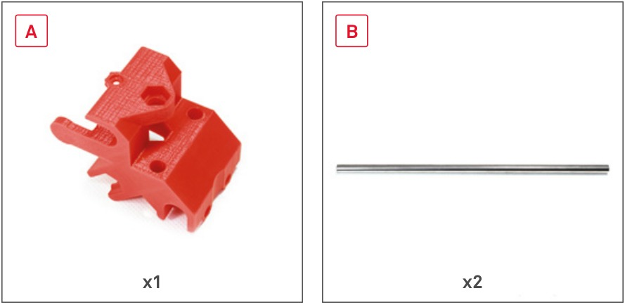  
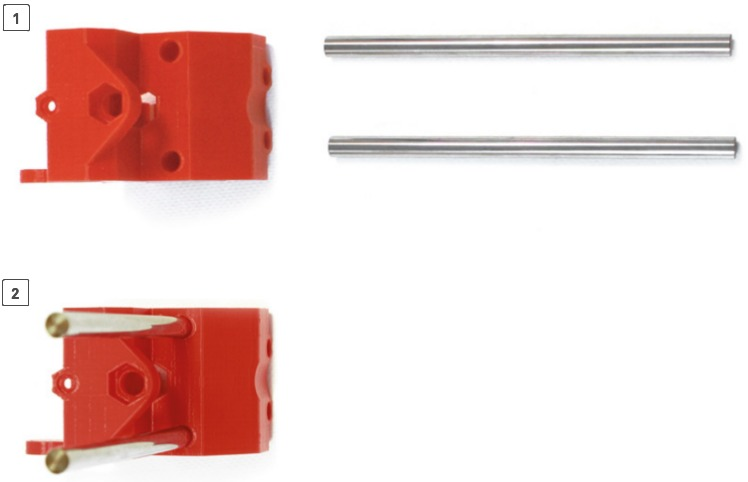  

2) Mettez les roulements à billes en place dans le charriot X
--
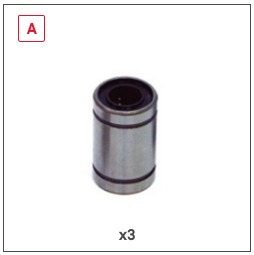  
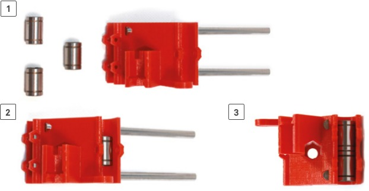  

3) Fixez les douilles avec les vis
--
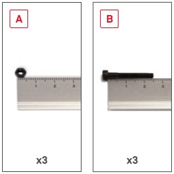  
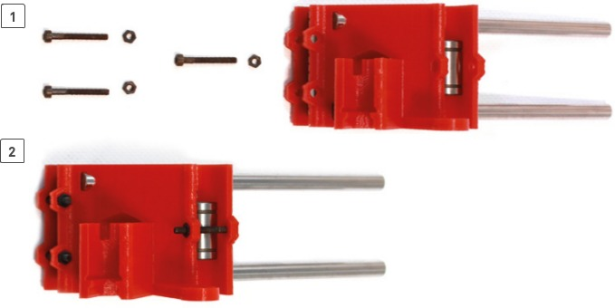  

4) Préparez la tige filetée de l'axe X
--
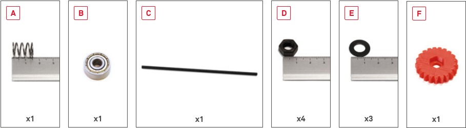  
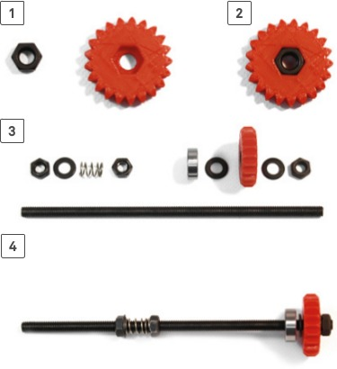  

5) Mettez en place la tige filetée de l'axe X
--
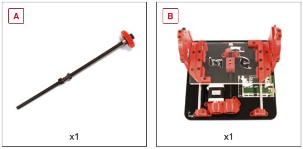  
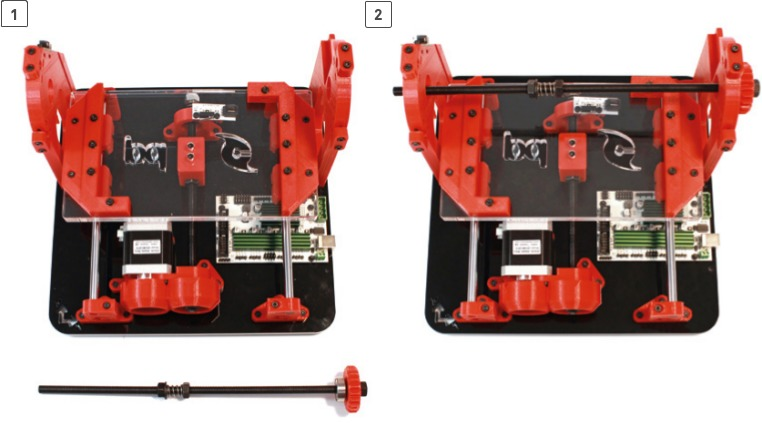  

6) Mettez le charriot X en place
--
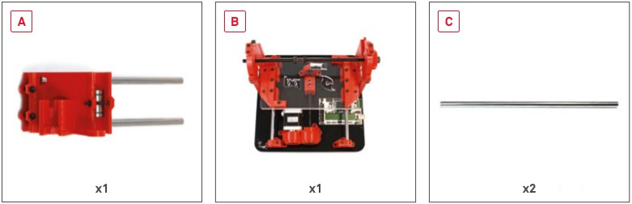  
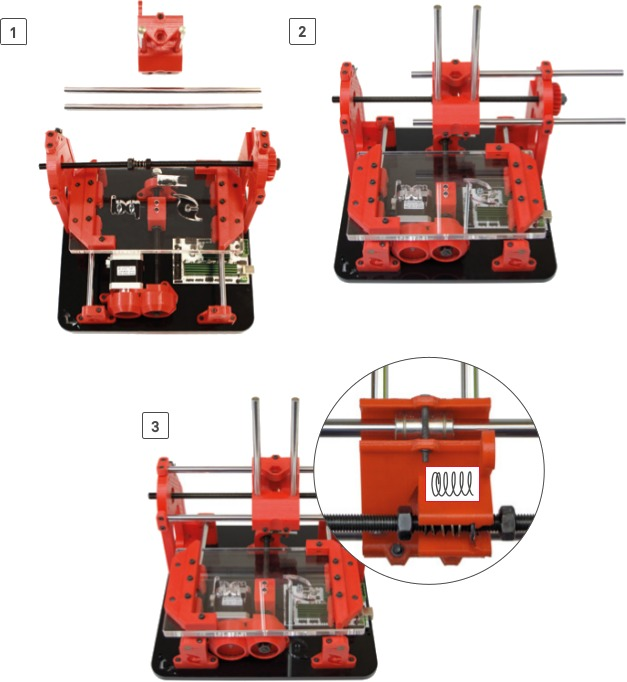  
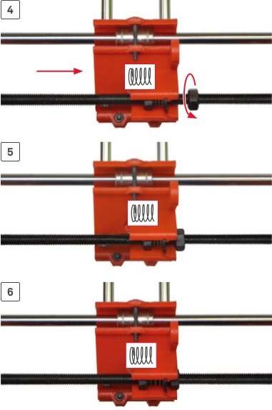  

7) Serrez les vis des pièces de maintien pour les tiges lisses
--
<!---
  
--->
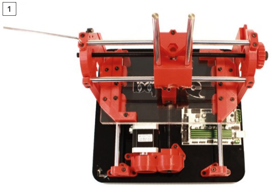  

8) Mettez une rondelle à l'extrémité de la tige filetée
--
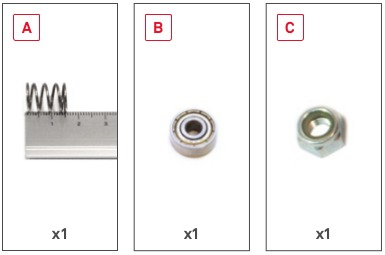  
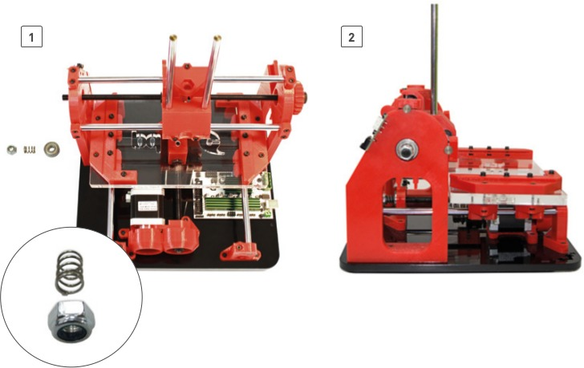  

9) Préparez le moteur de l'axe X
--
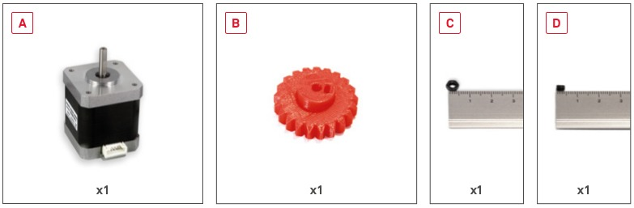  
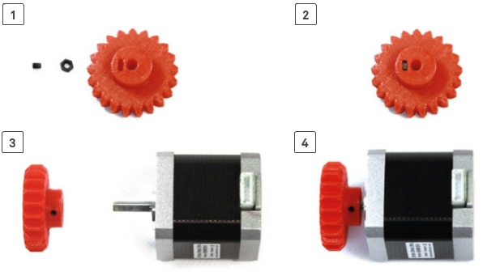  

10) Montez le moteur de l'axe X
--
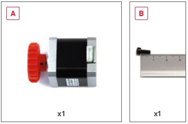  
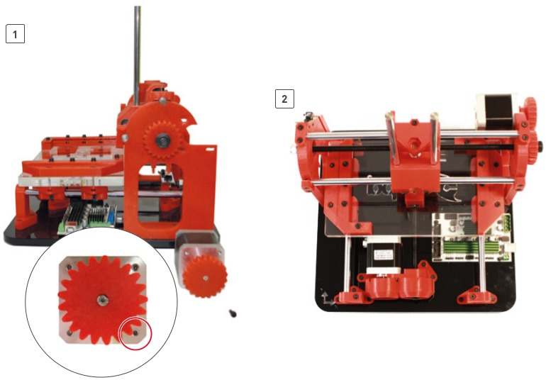  

11) Mettez en place le carter de protection des roues dentées de l'axe X
--
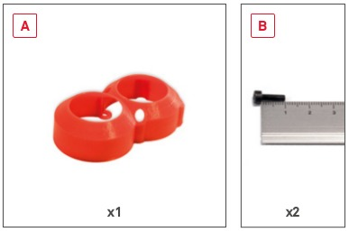  
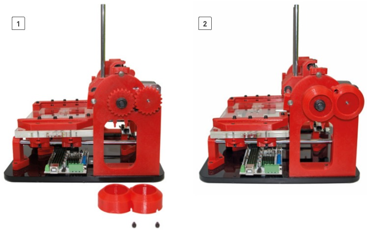  

Excellent ! Vous pouvez dès à présent paser à l'étape suivante, [l'assemblage de l'axe Z](Montage-axe-Z.md)  

