Ceci est la troisième partie du processus de montage. Vous devez avoir terminé l'étape précédente de [montage de l'axe X](Montage-axe-X.md).  

1) Insérez les douilles de roulement à billes dans le chariot Z
--
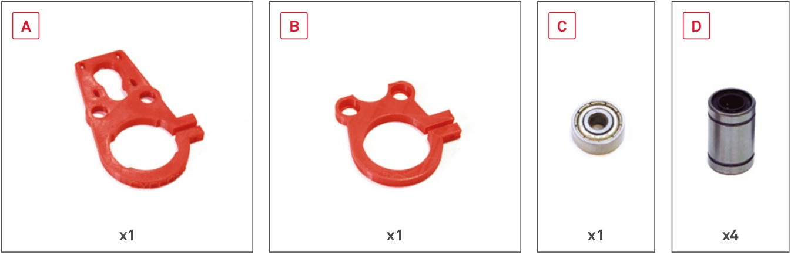  
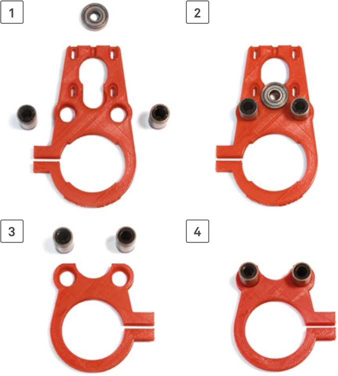  

2) Préparez la tige filetée de l'axe Z
--
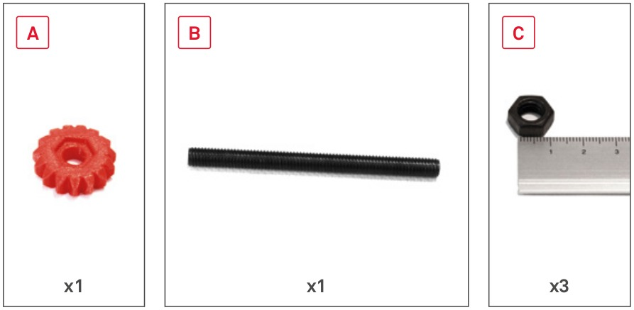  
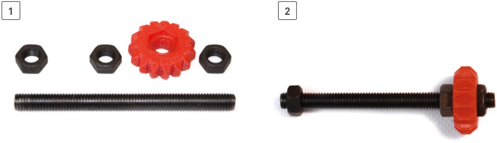  

3) Préparez le moteur pour l'axe Z
--
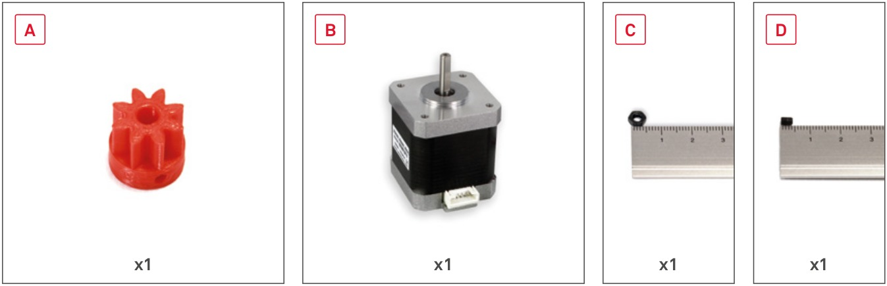  
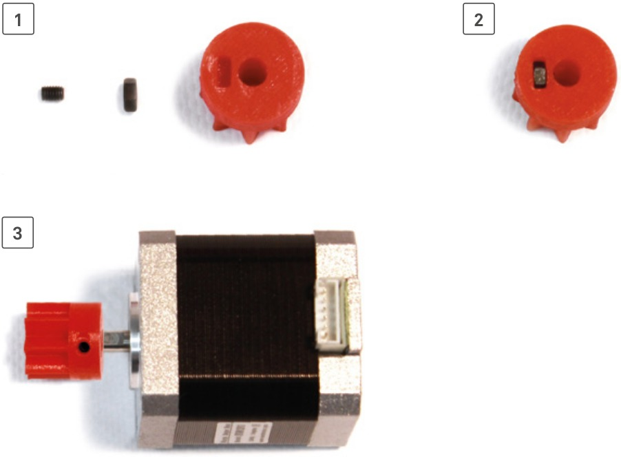  

4) Insérez les vis du chariot Z pour le maintien du spindle
--
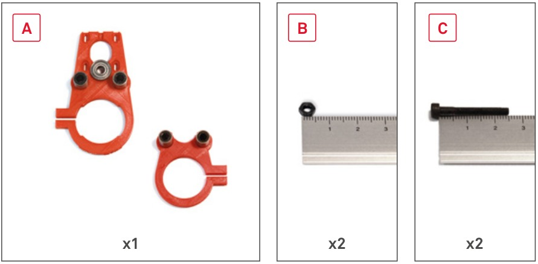  
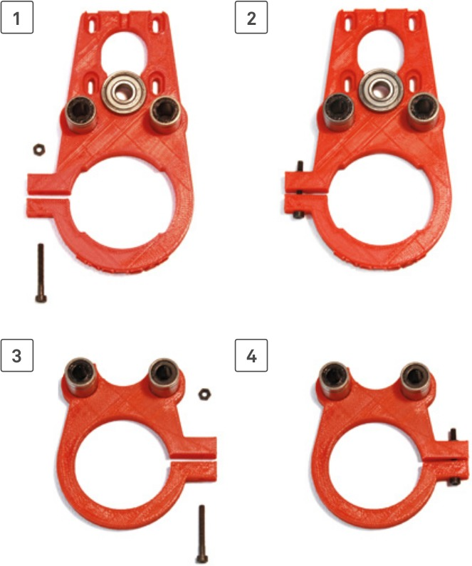  

5) Mettez en place le moteur pour l'axe Z
--
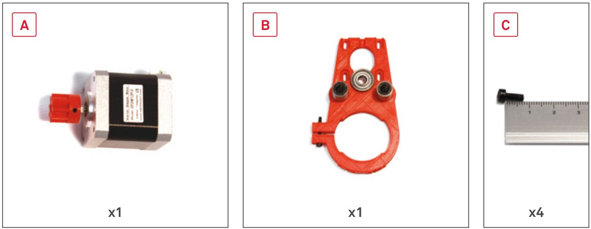  
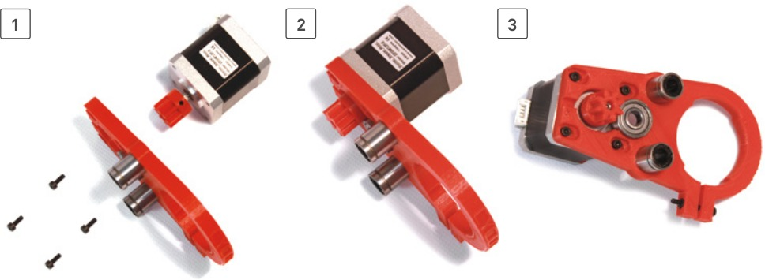  

6) Montez la partie inférieure du chariot Z
--
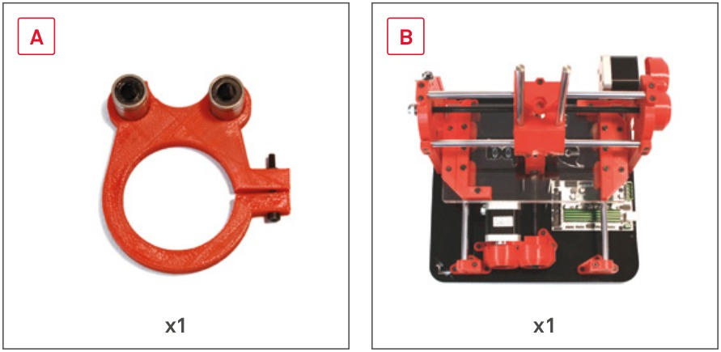  
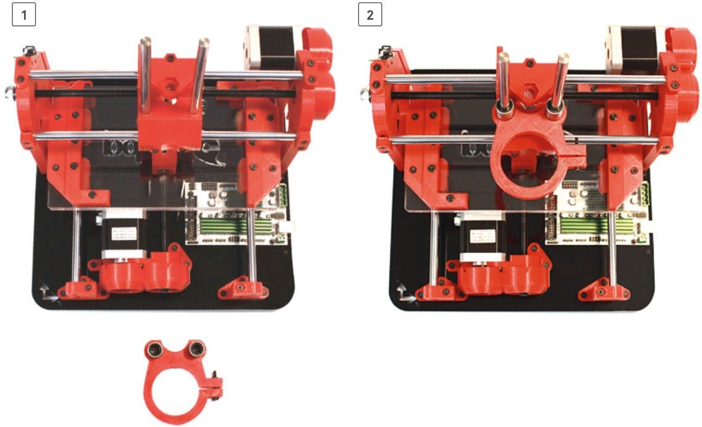  

7) Mettez la tige filetée Z en place
--
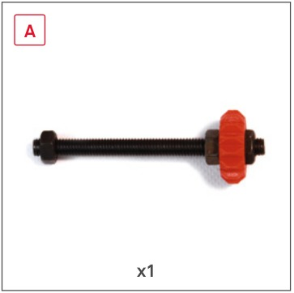  
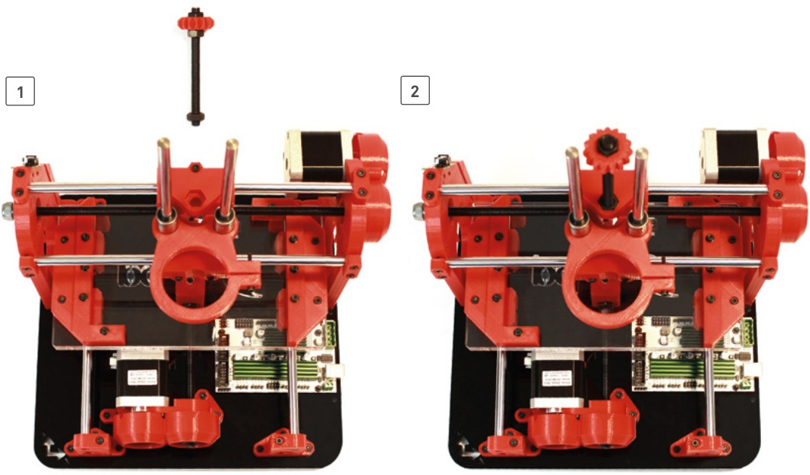  

8) Montez la partie supérieure du chariot Z
--
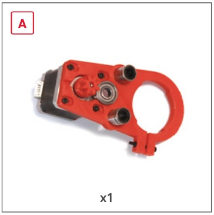  
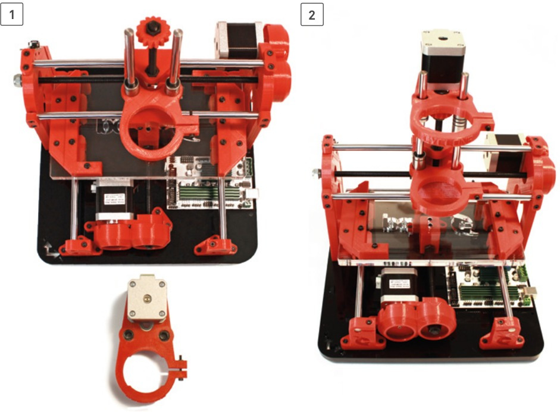  

9) Mettez en place le spindle
--
  
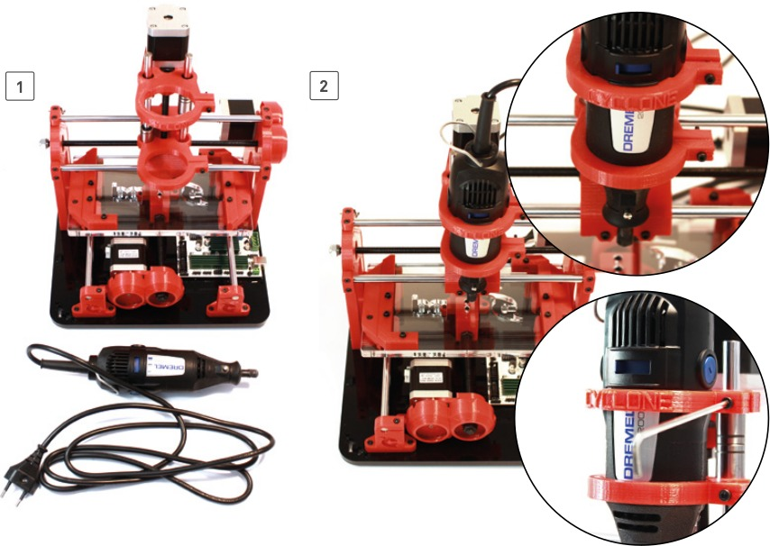  

10) Préparez les attaches pour le système d'aspiration (I)
--
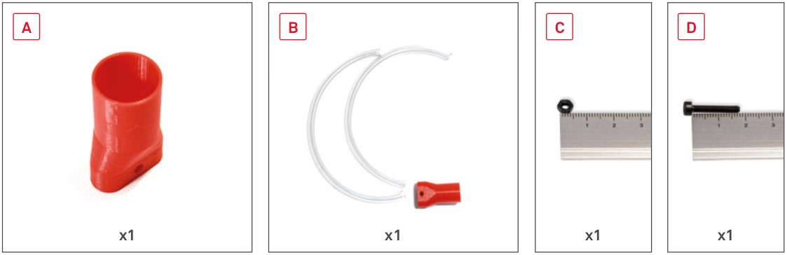  
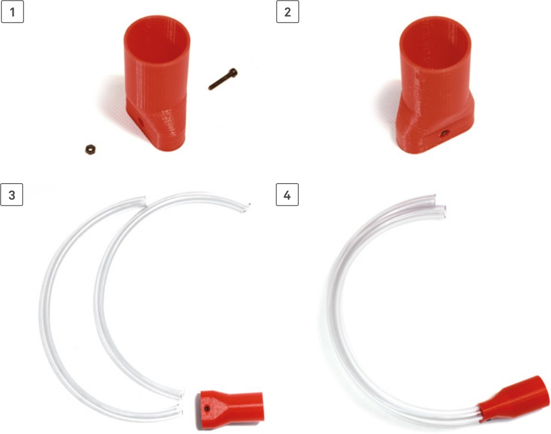  

11) Préparez les attaches pour le système d'aspiration (II)
--
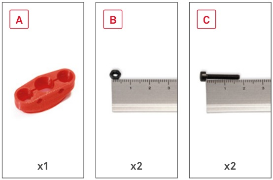  
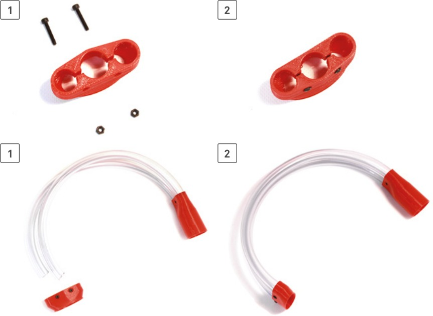  

12) Mettez en place les attaches pour le système d'aspiration
--
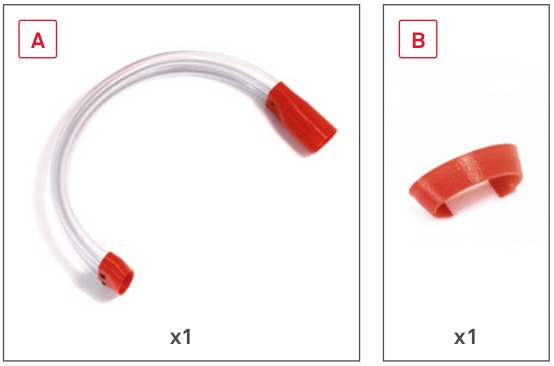  
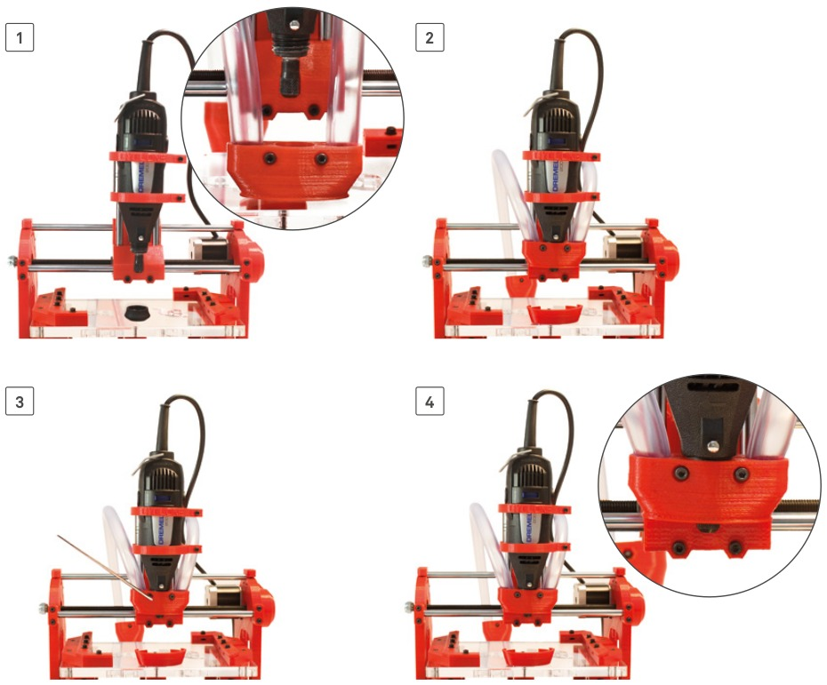  

Magnifique ! Vous approchez de la fin, il ne vous reste plus qu'à [connecter toute l'électronique](Connexion-electronique.md).  

